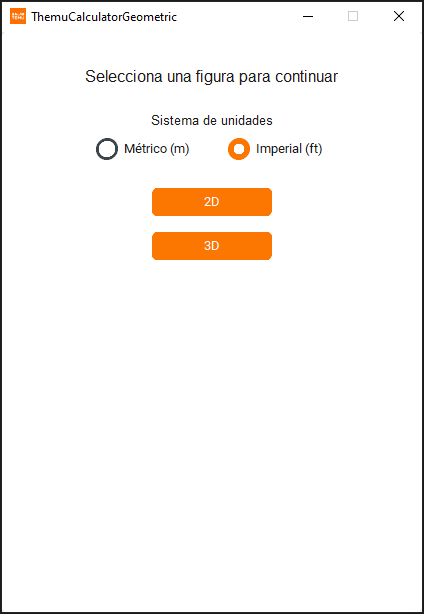

# Temu Geometric Calculator

<p align="center">
  
</p>

A desktop application built with Python and CustomTkinter that calculates geometric formulas for 2D and 3D figures. The interface guides the user through selecting a figure, choosing a formula, entering values, and displaying the result.

---

## Project Structure

```
geometric_calculator/
├── main.py
├── requirements.txt
├── temu.ico
├── temu.png
├── services/
│   ├── __init__.py
│   ├── shapes_2d/
│   │   ├── __init__.py
│   │   ├── circle.py
│   │   ├── square.py
│   │   ├── rectangle.py
│   │   ├── triangle.py
│   │   └── right_triangle.py
│   └── shapes_3d/
│       ├── __init__.py
│       ├── sphere.py
│       ├── cube.py
│       ├── cylinder.py
│       └── cone.py
└── utils/
    ├── __init__.py
    ├── geometry_data.py
    └── commons.py
```

Each file under `shapes_2d` and `shapes_3d` contains pure functions for a single figure. No external libraries are used in the math logic — `PI` is declared as a constant and all roots are computed with exponentiation (`** 0.5`, `** (1/3)`).

The `__init__.py` files re-export every function from their respective modules so `main.py` can import everything from a single path.

---

## Module Responsibilities

**`main.py`**
Entry point of the application. Builds and manages the CustomTkinter window and handles all view navigation logic: home, figure selection, formula selection, and input/result display.

**`utils/geometry_data.py`**
Central data module. Defines the global unit system state (`unit_system`), unit conversion constants, and the three core dictionaries used throughout the app: `FIGURES` (figures, formulas, functions, and parameters), `RESULT_TYPE` (maps each function name to its output measurement type), and `PARAM_TYPE` (maps each parameter name to its measurement type). Also holds `PARAM_LABELS`, the human-readable Spanish labels for each parameter.

**`utils/commons.py`**
Utility functions for the unit system. Contains `to_metric` (converts user input from imperial to metric before calculation), `to_display` (converts a metric result to the active unit for display), `unit_suffix` (returns the correct unit label such as `m`, `ft²`, or `m³`), and `param_label_with_unit` (builds the full field label with its unit, e.g. `"Radio (ft)"`).

---

## Figures and Formulas

**2D:** Circle, Square, Rectangle, Triangle, Right Triangle.

**3D:** Sphere, Cube, Cylinder, Cone.

Each figure has between 5 and 6 formulas, including direct calculations (area, volume, perimeter) and inverse ones that derive an unknown parameter from a known result (e.g. radius from area, side from volume).

All input values are validated before calculation. Each formula raises a `ValueError` with a descriptive message if any argument is out of range (e.g. negative dimensions, invalid triangle sides, angles outside the allowed range).

---

## Unit System

The application supports two unit systems selectable from the home screen:

- **Metric (m):** all inputs and results use meters, square meters, and cubic meters.
- **Imperial (ft):** all inputs and results use feet, square feet, and cubic feet.

Angles are always expressed in degrees regardless of the selected system.

The unit system is stored as a global string (`"metric"` or `"imperial"`) in `utils/geometry_data.py`. When imperial is active, `commons.py` converts inputs from feet to meters before passing them to the math functions, and converts results back to feet before displaying them. The math functions themselves always work in metric units internally.

---

## Requirements

- Python 3.10 or higher
- CustomTkinter

All dependencies are listed in `requirements.txt`.

---

## Setup

**1. Clone the repository**

```bash
git clone https://github.com/Zerik-Official/TemuGeometricCalculator
cd TemuGeometricCalculator
```

**2. Create and activate a virtual environment**

On macOS / Linux:
```bash
python3 -m venv venv
source venv/bin/activate
```

On Windows:
```bash
python -m venv venv
venv\Scripts\activate
```

**3. Install dependencies**

```bash
pip install -r requirements.txt
```

**4. Run the application**

```bash
python main.py
```

or

```bash
python3 main.py
```

---

> Version 2.0

> The application interface is in Spanish, but all code and comments are written in English for clarity.